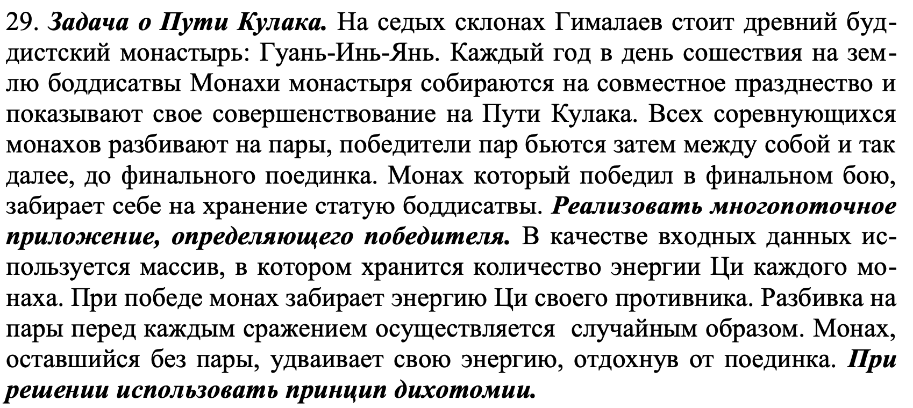

# Артемов Никита Владиславович БПИ219
## Вариант 29

Условие задания: 

#### Задание решено на: [8 баллов]()

> - Тестирование всех программ проводилось с помощью python скриптов: [gen_tests.py](./bridge/gen_tests.py), [run_tests.py](./bridge/run_tests.py)
> - Можно сгенерировать новые тесты и провести их командой python3 <file_name>.py
> - Все тесты лежат в папке: [tests](./bridge/tests)

---

## Решение
Исходный код на c++: [main.cpp](./bridge/main.cpp)
```c++
#include <iostream>
#include <fstream>
#include <vector>
#include <cstring>
#include <random>
#include <pthread.h>
#include <algorithm>

using namespace std;

// файл для записи логов
ofstream logout("./logger.txt");

// Сущность структура монаха, поля: сила и id
struct Monk {
    int power;
    int id;

    Monk(int p, int i) {
        power = p;
        if (power == 0) {
            power++;
        }
        id = i;
    }

    Monk() {
        power = -1;
        id = -1;
    }

    Monk(const Monk& other) {
        this->power = other.power;
        this->id = other.id;
    }
};

// Ввод строки монахов из файла или консоли и возврат массива монахов
vector<Monk> input(istream& in) {
    vector<Monk> monks;
    int k = 1, a;
    in >> a;
    while (a != 0) {
        monks.emplace_back(a, k++);
        in >> a;
    }
    return monks;
}

// Вывод сообщения о победе
void outputAnswer(ostream& out, Monk& monk) {
    out << "Победил монах с порядковым номером первоначального массива " << monk.id << " и силой "
        << monk.power << ". Он получил великую статую боддисатвы!\n";
}

void* fight(void* m) {
    vector<Monk> monks = *(vector<Monk>*)m;  // каст void* к вектору объектов Monk
    logout << "Текущий поток производит сражение " << monks.size()
           << " монахов.\n";  // Вывод сообщения об информации потока в файл logger.txt
    if (monks.size() == 1) {  // Если в функцию передан вектор с одним Монахом, то есть у монаха нет
                              // противника - увеличиваем его силу в два раза
        monks[0].power *= 2;
        return new Monk(monks[0]);  // возвращается указатель на созданный объект монаха
    }

    // Если в векторе 2 монаха побеждает сильнейший
    if (monks.size() == 2) {
        if (monks[0].power < monks[1].power) {
            monks[1].power += monks[0].power;
            return new Monk(monks[1]);  // возвращается указатель на созданный объект монаха
        } else {
            monks[0].power += monks[1].power;
            return new Monk(monks[0]);  // возвращается указатель на созданный объект монаха
        }
    }

    // Перемешивается массив с помощью генератора случайных данных с сидом(текущее время)
    shuffle(monks.begin(), monks.end(), default_random_engine(clock()));
    Monk *m1, *m2;     // Создаются указатели Monk
    pthread_t p1, p2;  // Создание двух новых потоков для запуска двух функций с укороченными в два
                       // раза векторами монахов
    // Векторы с монахами делятся пополам, пока не дойдут до случая - 1/2 монаха
    // Создание укороченных в два раза векторов
    vector<Monk> v1 = vector<Monk>(monks.begin(), monks.end() - monks.size() / 2);
    vector<Monk> v2 = vector<Monk>(monks.end() - monks.size() / 2, monks.end());
    pthread_create(&p1, nullptr, fight,
                   &v1);  // Создание первого потока и запуск функции fight с укороченным вектором
    pthread_create(&p2, nullptr, fight,
                   &v2);  // Создание второго потока и запуск функции fight с укороченным вектором
    pthread_join(p1,
                 (void**)&m1);  // Ожидание первого потока и запись возврата функции в указатель m1
    pthread_join(p2,
                 (void**)&m2);  // Ожидание второго потока и запись возврата функции в указатель m2

    // Возврат победителя и чистка памяти
    if (m1->power < m2->power) {
        m2->power += m1->power;
        delete m1;
        return m2;
    } else {
        m1->power += m2->power;
        delete m2;
        return m1;
    }
}

int main(int argc, char* argv[]) {
    srand(clock());  // сид рандома - текущее время, чтобы не повторялись генерации
    vector<Monk> monks;
    ifstream fin;
    ofstream fout;
    // Создаем поток для ввода из файла в зависимости от того, введен ли путь до файла ввода в виде
    // аргумента командной строки
    if (argc > 2) {
        fin = ifstream(argv[2]);
    } else {
        fin = ifstream("./in.txt");
    }
    // Создаем поток для ввода в файл в зависимости от того, введен ли путь до файла ввода в виде
    // аргумента командной строки
    if (argc > 3) {
        fout = ofstream(argv[3]);
    } else {
        fout = ofstream("./out.txt");
    }
    // Проверка на количество аргументов командной строки
    if (argc < 2 || argc > 4) {
        cout << "Вы обязаны ввести 1,2 или 3 аргумента командной строки:\n"
                "Первый - -f/-r/-c.\n"
                "Второй и третий опциональны, "
                "это абсолютный путь к файлам ввода и вывода.\n";
        return 1;
    }

    if (strcmp(argv[1], "-f") == 0) {  // Ввод из файла
        monks = input(fin);
        if (monks.size() < 2) {
            cout << "Ошибка! Нужно ввести минимум 2 монаха.\n";
            return 1;
        }
    } else if (strcmp(argv[1], "-c") == 0) {  // Ввод из консоли
        cout << "Вводите силы монахов через пробел, 0 оканчивает ввод.\n";
        monks = input(cin);
        if (monks.size() < 2) {
            cout << "Ошибка! Нужно ввести минимум 2 монаха.\n";
            return 1;
        }
    } else if (strcmp(argv[1], "-r") == 0) {  // Генерация случайных данных
        cout << "Введите количество монахов (от 1 до 1000): ";
        int n;
        cin >> n;
        while (n < 2 || n > 1000) {
            cout << "Ошибка! Введите количество монахов (от 2 до 1000): ";
            cin >> n;
        }
        ofstream rout("./rand_in.txt");  // поток для вывода сгенерированных данных
        for (int i = 0; i < n; i++) {
            monks.emplace_back(rand() % 100, i + 1);
            rout << monks[monks.size() - 1].power << ' ';
        }
        rout << 0 << endl;
    } else {  // Если неверный аргумент командной строки - выход
        cout << "Неверный аргумент командной строки.";
        exit(1);
    }

    Monk* winner;  // Указатель на объект структуры Монах

    pthread_t p1;  // создание первого и главного потока
    pthread_create(&p1, nullptr, fight,
                   &monks);  // создание потока и запуск функции fight для решения задачи, массив
                             // монахов передается по ссылке.
    pthread_join(p1, (void**)&winner);  // ожидание потока и запись возврата из функции fight в
                                        // память по указателю winner (Monk*)

    // Вывод в зависимости от аргументов командной строки
    if (strcmp(argv[1], "-c") == 0) {
        outputAnswer(cout, *winner);
    } else {
        outputAnswer(fout, *winner);
    }
    delete winner;  // чистим память
    logout << "END OF TEST\n<============================>\n\n";
    return 0;
}
```

#### Используемая модель параллельных вычислений: параллелизм данных
>В этой модели программы, возможно различные, написанные на традиционном последовательном языке исполняются процессорами компьютера. Каждая программа имеют доступ к памяти исполняющего е§ процессора. Программы обмениваются между собой данными, используя подпрограммы приема/передачи данных некоторой коммуникационной системы. Программы, использующие обмен сообщениями, могут выполняться только на MIMD компьютерах.


#### Порядок аргументов командной строки:
1. -f/-r/-с (файловый ввод и вывод / строка генерируется рандомно и выводится в файл / консольный ввод) 
— обязательный аргумент
2. <полный путь к файлу для ввода строки> — необязательный аргумент
3. <полный путь к файлу для вывода строки> — необязательный аргумент

> При вводе некорректных данных - иногда UB, а иногда отлавливается, поэтому требование к работе с программой - это ввод корректных данных.
Корректными данными считается строка чисел через пробел, оканчивающаяся нулем. Сила монаха не может быть нулевой.
Должно быть от 2 монахов до 1500. Силы монахов должны быть от 1 и до 1000.
Файл для чтения или записи должен быть формата .txt, иначе - UB.

#### По умолчанию:
- ввод происходит из файла [in.txt](./bridge/in.txt)
- вывод происходит в файл [out.txt](./bridge/out.txt)
- при генерации случайных исходных данных эти данные сохраняются в файле [rand_in.txt](./bridge/rand_in.txt)

***

Исходный файл был компилирован через g++ с флагом:
```sh
$g++ main.cpp -lpthread
```
Полученный файл: [a.out](./bridge/a.out)

А также запущен и протестирован:
```sh
$./a.out <command line arguments>
```

Результаты тестов: [tests](./bridge/tests)

--- 
> - В чем смысл программы: моделирование реальной системы турниров - n участников турнира делятся на пары
> и сражаются друг с другом, победители переходят на следующий этап и так далее, пока не останется 2 участника турнира. 
> Далее победитель последнего сражения становится победителем турнира.
> - В данной программе участник турнира - это монахи, в программе монахи представляют собой объекты структуры 
> Monk c полями id (идентификационный номер) и power (сила). 
> - Вся логика программы разделятся на 3 части: ввод массива, функция fight, вывод результата.
> - После ввода вызывается функция fight в потоке созданном в main и передается введенный массив монахов.
> - В функции fight вся логика системы турниров:
>   1. Получение вектора монахов из указателя void и проверка количества монахов в векторе, если 1 или 2 монаха то происходит сражение двух монахов и возврат из функции победителя.
>   2. Если монахов в векторе больше двух - вектор перемешивается для радномного распределения противников.
>   3. Все монахи делятся на две группы.
>   4. Вызывается рекурсивно в двух новых потоках функции fight для двух мЕньших групп.
>   5. Далее идет ожидание - когда закончит работу рекурсивные вызовы (ожидание двух созданных потоков).
>   6. Каждый из двух вызовов параллельно в своих потоках со своими данными (данные в двух потоках не пересекаются) определяют победителя своей группы и если нужно делит рекурсией на подгруппы монахов.
>   7. Самые глубокие рекурсивные вызовы возвращает победителя - первый этап турнира. Ожидание потоков с самыми глубокими рекурсивными вызовами заканчивается и победители первого этапа сражаются во втором этапе. Так, дальше разворачивается стек рекурсии и проходит турнир.
> - В разных потоках одного уровня рекурсии данные не пересекаются и имеет место параллелизм данных. Проигравшие монахи откидываются и остается обрабатывать только возвраты из функции fight пока не останется 1 победитель.
> - Смысл использования многопоточности в том, чтобы сражения подгрупп групп вычислять параллельно. 
> - Более корректно было бы сделать ограничение, что если монахов < 16 (или какое-либо небольшое число) - сражения этих монахов происходили в одном потоке не разделяясь, потому что создание новых поток ресурсозатратно (как и времязатратно), однако было решено использование данного алгоритма в образовательных целях.
> - 